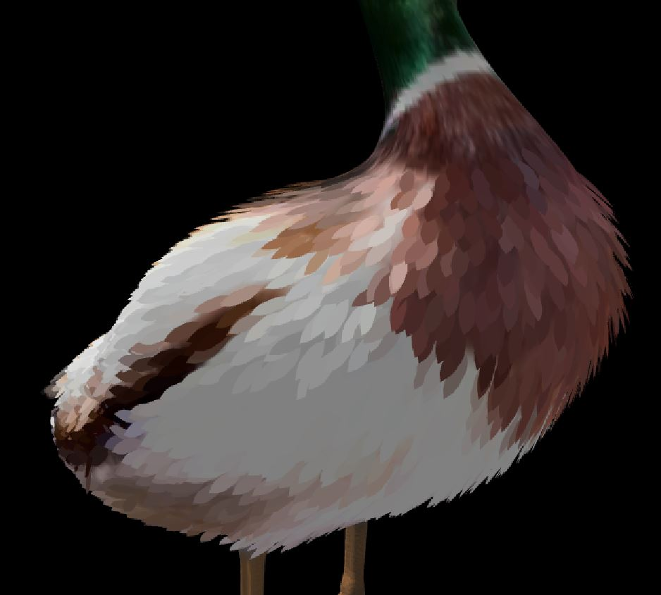

# glsl-feather-shader
GLSL feather instancing geometry shader for Unity

# Usage

- Start Unity with -force-opengl 

- Create a new GLSL shader in unity and replace code

# Be Aware

- Please be aware that this is mainly for demonstration of how to write a geo shader

- Light loop only supports one light, and no shadows
